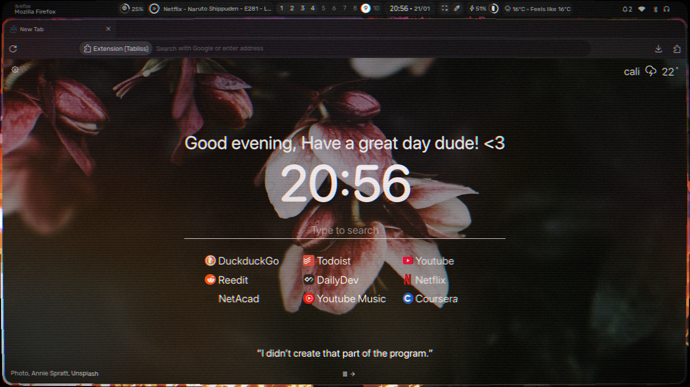
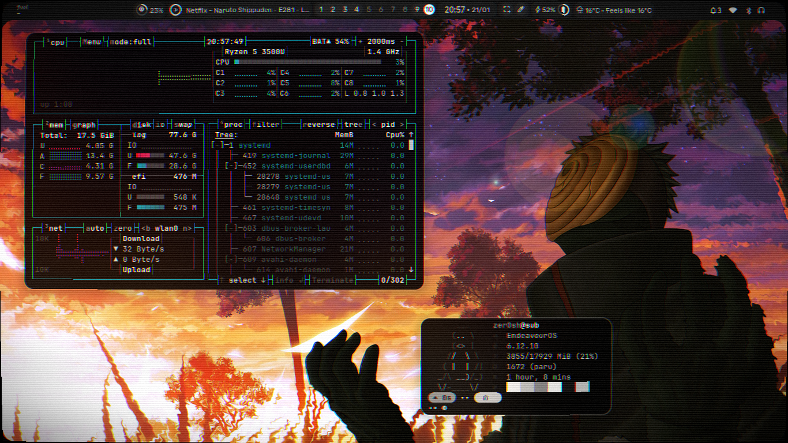
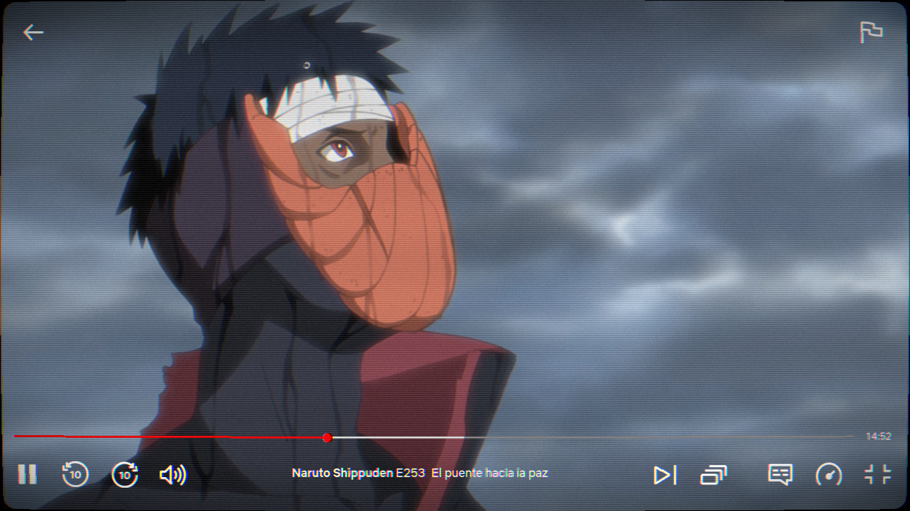

# Retro Shader 4 Hyprland

Retro Hyprland is a shader designed to emulate the look and feel of old cathode ray tube screens. It aims to be visually appealing, highly customizable, and lightweight, providing an enjoyable retro aesthetic for your setup.

## Screenshots

<video width="800" height="600" controls>
  <source src="./media/example_video.mp4" type="video/mp4">
  Your browser does not support the video tag.
</video>  
*Example of Retro Shader 4 Hyprland in action.*


*Screenshot 1*


*Screenshot 2*


*Screenshot 3*


## Installation and Enabling the Shader

To install Retro Shader 4 Hyprland, simply download the `crt_hypr.frag` file and place it in any directory of your choice.

Once downloaded, you can enable the shader with the following command:

```sh
hyprctl keyword decoration:screen_shader '~/yourlocalfolder/crt_hypr.frag'
```

To disable it, use the following command:

```sh
hyprctl keyword decoration:screen_shader ''
```

## Alternative Usage Methods

### For Bash or Zsh

1. Open your shell configuration file (`~/.bashrc` or `~/.zshrc`) and add the following lines at the end of the file:

    ```bash
    alias enablecrtshader="hyprctl keyword decoration:screen_shader '~/.config/hypr/shaders/crt_hypr.frag'"
    alias disablecrtshader="hyprctl keyword decoration:screen_shader ''"
    ```

2. Apply the changes by running:

    ```sh
    source ~/.bashrc   # Or source ~/.zshrc for Zsh
    ```

### For Fish

In Fish, aliases are defined using the `alias` function instead of the standard Bash/Zsh syntax. Open your configuration file (`~/.config/fish/config.fish`) and add the following lines:

```fish
alias enablecrtshader 'hyprctl keyword decoration:screen_shader "~/.config/hypr/shaders/crt_hypr.frag"'
alias disablecrtshader 'hyprctl keyword decoration:screen_shader ""'
```

Then, apply the changes by running:

```fish
source ~/.config/fish/config.fish
```

Now you can use the `enablecrtshader` and `disablecrtshader` commands directly in your terminal.

---

Feel free to contribute or modify the shader for further customization!

